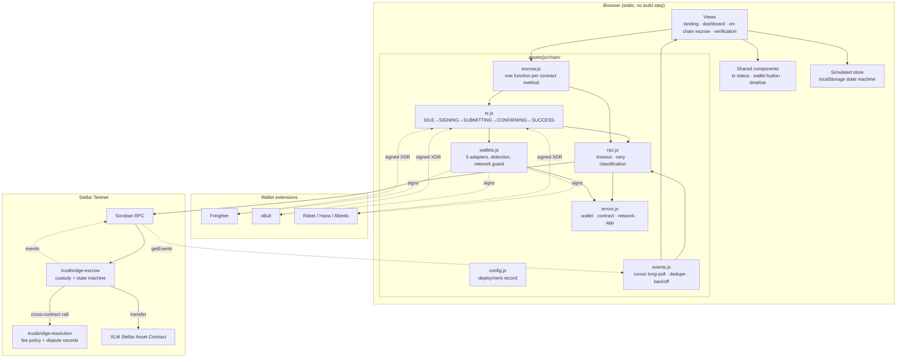
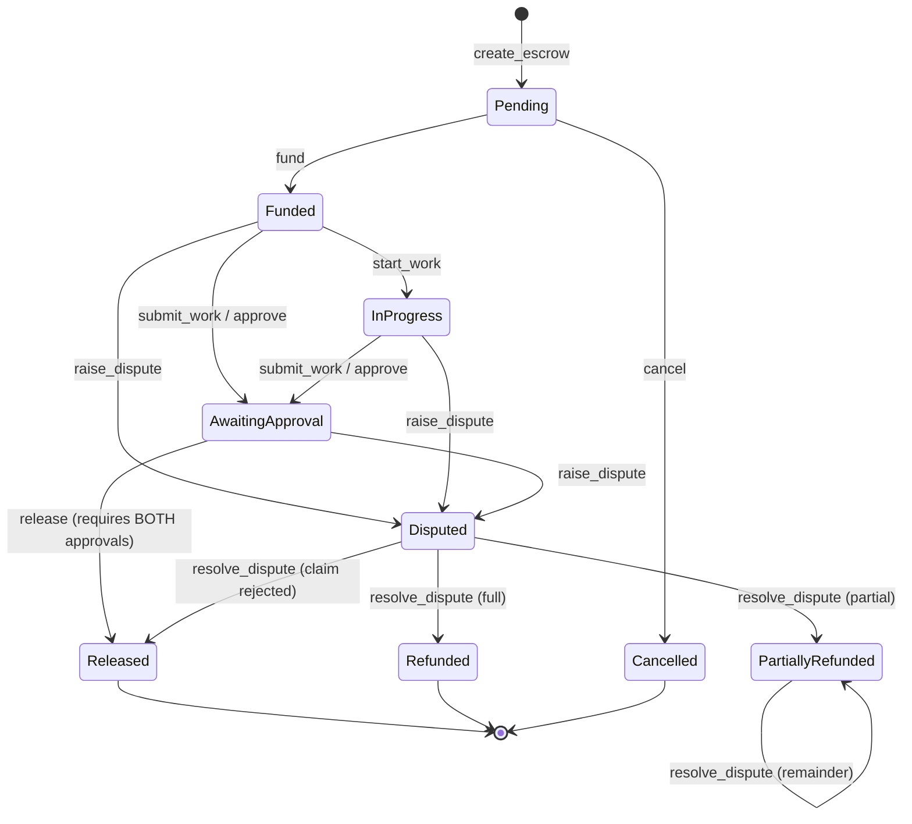

# TrustBridge

Peer-to-peer escrow on **Stellar / Soroban**, with dual-approval release,
dispute protection and partial refunds.

Funds are held by a smart contract and released only when the buyer **and** the
seller have each recorded an independent approval. Either party can open a
dispute while funds are held, which locks the release until Trust & Safety
settles it with a full refund, a partial refund, or a release of the remainder.

> **Prototype on Stellar Testnet.** Testnet XLM has no value. See
> [SECURITY.md](SECURITY.md) before pointing anything at mainnet.

---

## Overview

TrustBridge has two halves that share one interface:

| | On-chain | Simulated |
|---|---|---|
| Where | **On-chain Escrow** page | Dashboard, Transactions, Disputes, Wallet |
| Funds | Real testnet XLM held by the escrow contract | Numbers in `localStorage` |
| State | The contract is the source of truth | Local state machine |
| Signing | Your Stellar wallet | None |
| Purpose | Proves the escrow guarantees on a real network | Explores the full product workflow with realistic data |

Both are clearly labelled in the UI. The simulated half exists because a
hackathon judge should be able to see the whole product in 30 seconds without
funding a wallet; the on-chain half is where the guarantees are real.

---

## Architecture



**Why two contracts.** Fee policy changes more often than custody logic.
Splitting them means changing the fee never requires redeploying the contract
that holds user funds. The escrow calls the resolution contract for a fee quote
at release time and to record dispute settlements; if that call fails, the
escrow emits `resolution_call_failed`, treats the fee as zero and settles
anyway — a broken fee contract can never strand user funds.

### Escrow state machine



`transition()` in `contracts/escrow/src/lib.rs` is the single declaration of
legal moves. Anything else returns `Error::InvalidState`.

---

## Features

- **Peer-to-peer escrow** — funds custodied by the contract, not by us
- **Dual approval** — `release` returns `ApprovalsMissing` unless both parties
  approved; the admin cannot bypass it
- **Disputes** — either party can lock the release while funds are held;
  approvals freeze during review
- **Partial refunds** — split the escrow, with `refunded + released + held`
  always equal to the funded amount
- **Multi-wallet** — Freighter, xBull, Rabet, Hana, Albedo, with real detection
  and a network-mismatch guard
- **Real-time events** — the UI updates from contract events without a reload
- **Transaction tracking** — hash, live status, explorer link and refresh for
  every transaction, kept across reloads
- **Inter-contract communication** — real cross-contract calls, with safe
  failure containment
- **Technical verification page** — checks itself at runtime instead of showing
  hardcoded ticks

---

## Tech stack

| Layer | Choice | Why |
|---|---|---|
| Contracts | Rust + `soroban-sdk` 27 | Soroban is Stellar's smart-contract platform |
| Contract events | `#[contractevent]` | Struct name in snake_case becomes the topic |
| Chain client | `@stellar/stellar-sdk` 17, vendored browser bundle | No CDN, satisfies `script-src 'self'` |
| Frontend | Vanilla ES5-compatible JS, no framework, no bundler | Zero build step; the app has **no runtime dependencies** |
| Styling | Hand-written CSS with design tokens | Dark/light as two selected token sets |
| Charts | Inline SVG, single series | Identity from axis labels, never hue |
| Local server | `serve.js`, Node standard library only | Nothing to install to run it |
| Tests | `cargo test` + three headless Node suites (jsdom) | 321 assertions, no test framework dependency |
| CI | GitHub Actions | Lint, contract tests, frontend tests, build, deployment validation |

---

## Local setup

Prerequisites: **Node 18+**. For the contracts also **Rust** (stable) with the
`wasm32v1-none` target.

```bash
# 1. run the app (no dependencies needed)
npm start                       # http://localhost:3000

# 2. dev dependencies, for the test suites
npm install

# 3. contracts
rustup target add wasm32v1-none
npm run contracts:test          # 72 Rust tests
npm run contracts:build         # -> target/wasm32v1-none/release/*.wasm

# 4. deploy to Stellar Testnet (creates + funds a keypair on first run)
npm run chain:deploy
npm run chain:verify            # 20 live checks
npm run chain:test              # 33 live end-to-end assertions, real XLM
```

`chain:deploy` writes `chain-config.json` and
`assets/js/chain/config.generated.js`. The frontend reads the latter; without
it, the on-chain page explains what to run and the simulated app is unaffected.

### Demo accounts (simulated half)

Password `demo1234` for all three; the login screen has one-click buttons.

| Role | Email |
|---|---|
| Buyer | `buyer@trustbridge.app` |
| Seller | `seller@trustbridge.app` |
| Admin (Trust & Safety) | `admin@trustbridge.app` |

---

## Environment variables

No secret is ever required to *run* the app. These affect the tooling only.

| Variable | Used by | Default | Notes |
|---|---|---|---|
| `TB_DEPLOYER_SECRET` | `chain:deploy`, `chain:test` | falls back to `tools/chain/.deployer.json` | **Secret.** Stellar secret key of the deploying/admin account. Never commit. |
| `TB_STELLAR_NETWORK` | chain tooling | `testnet` | `testnet` or `public` |
| `TB_SOROBAN_RPC_URL` | chain tooling | `https://soroban-testnet.stellar.org` | Override the RPC endpoint |
| `TB_FRIENDBOT_URL` | chain tooling | `https://friendbot.stellar.org` | Testnet funding |
| `TB_FEE_BPS` | `chain:deploy` | `250` | Platform fee in basis points, capped at 1000 by the contract |
| `PORT` | `serve.js` | `3000` | Local server port |

The **frontend** takes no environment variables: it is a static site, so its
configuration is the generated `config.generated.js`, which contains public
data only (network, RPC URL, contract IDs, transaction hashes, the admin
*public* key). `npm run lint` fails if a secret key appears in any trackable
file.

Optional GitHub secrets for CI (the pipeline works without them):
`TB_SOROBAN_RPC_URL`, and `TB_DEPLOYER_SECRET` only if you add a deploy job.

---

## Testing

```bash
npm run lint            # syntax, secrets, eval/CSP, native dialogs, SDK traps
npm run contracts:test  # 72  Rust contract tests
npm test                # 93  escrow state machine
npm run test:render     # 65  full app rendering in jsdom
npm run test:chain      # 91  chain layer: wallets, tx lifecycle, errors, events
npm run test:all        # the three frontend suites
npm run report          # runs everything, writes test-report.json
npm run chain:verify    # 20  live checks against the deployed contracts
npm run chain:test      # 33  live end-to-end assertions on Testnet (real XLM)
```

| Suite | Count | Network? | Covers |
|---|---:|---|---|
| `cargo test` | 72 | no | Contract logic, authorisation, illegal transitions, duplicate ops, refund arithmetic, event payloads, cross-contract success **and failure** |
| `tools/chain/integration-test.js` | 33 | **yes** | The same guarantees on live Testnet, with real transaction hashes |
| `tools/chain-unit-test.js` | 91 | no (stubbed) | Wallet unavailable/rejected/wrong-network, lifecycle ordering, error classification, event decode + dedupe |
| `tools/logic-test.js` | 93 | no | Simulated escrow state machine, wallet conservation |
| `tools/render-test.js` | 65 | no | Every route for every role, all modals, filters |
| `tools/chain/verify-deployment.js` | 20 | **yes** | Contract instances exist, wasm hashes match, bindings agree both ways |

**321 automated assertions** plus 20 live deployment checks. The build fails if
any of them do.

---

## Stellar Testnet deployment

```bash
npm run contracts:test          # never deploy a failing contract
npm run contracts:build         # cargo rustc --crate-type cdylib (wasm only)
npm run chain:deploy            # upload → instantiate → init → bind → verify
npm run chain:verify            # independent confirmation
```

`chain:deploy` performs eight steps, each printing its transaction hash:

1. load or create the deployer keypair, fund it from Friendbot
2. upload both wasm blobs
3. instantiate both contracts
4. `resolution.init(admin, fee_bps)`
5. `escrow.init(admin, resolution, token, fee_recipient)`
6. `resolution.register_escrow(escrow)` — binds the cross-contract authorisation
7. read both contracts back and assert the bindings agree in **both** directions
8. write `chain-config.json` + `assets/js/chain/config.generated.js`

Re-running deploys a fresh pair and rewrites the config; `--keep` aborts if a
deployment already exists.

> **`cdylib` is requested on the command line, not in `Cargo.toml`.** Declaring
> it in the manifest makes cargo link a *host* dynamic library during
> `cargo test`, which needs an external mingw gcc on Windows. Keeping the
> manifest at `rlib` and passing `--crate-type cdylib` for the wasm target
> avoids that entirely.

### Upgrading a deployed contract

`escrow.upgrade(new_wasm_hash)` is admin-gated and uses Soroban's native
`update_current_contract_wasm`. Storage is additive by convention: `Escrow`
fields are appended and `Status` discriminants are never renumbered, because
the frontend maps status by integer. To swap fee policy without touching
custody, deploy a new resolution contract and call
`escrow.set_resolution(new_id)`.

---

## Contract addresses

Live on **Stellar Testnet**, deployed 31 Aug 2026. Also in
[`chain-config.json`](chain-config.json).

| Contract | ID |
|---|---|
| Escrow | [`CDV44SSWYJAKHBBXIEJELJYEFYC24DGWLZZ6QR3UJ2TG4LJERXAKOVFD`](https://stellar.expert/explorer/testnet/contract/CDV44SSWYJAKHBBXIEJELJYEFYC24DGWLZZ6QR3UJ2TG4LJERXAKOVFD) |
| Resolution / fee | [`CD5VSNBXJVIHUCE6YRU26UTNICVSMG6S6GWUKGV2FFGOIRHQ7CDQZE3L`](https://stellar.expert/explorer/testnet/contract/CD5VSNBXJVIHUCE6YRU26UTNICVSMG6S6GWUKGV2FFGOIRHQ7CDQZE3L) |
| Token (native XLM SAC) | `CDLZFC3SYJYDZT7K67VZ75HPJVIEUVNIXF47ZG2FB2RMQQVU2HHGCYSC` |

Platform fee: **250 bps (2.5%)**, charged on released amounts only — a refund is
never reduced by a fee.

If you redeploy, these change. `npm run chain:verify` always reports what is
actually configured, and the in-app **Verification** page reads it live.

---

## Contract events

Emitted with `#[contractevent]`, so the struct name in snake_case is the topic
the frontend subscribes to.

| Event | Topics | Emitted when |
|---|---|---|
| `escrow_created` | escrow_id, buyer | An escrow is opened |
| `escrow_funded` | escrow_id, funder | Funds enter custody |
| `work_started` | escrow_id | Seller starts |
| `work_submitted` | escrow_id | Seller submits for approval |
| `approval_submitted` | escrow_id, party | Either party approves |
| `approval_withdrawn` | escrow_id, party | An approval is retracted |
| `funds_released` | escrow_id, seller | Payout executed |
| `dispute_raised` | escrow_id, raised_by | Release locked |
| `dispute_resolved` | escrow_id | Trust & Safety settles |
| `refund_processed` | escrow_id, buyer | Full refund |
| `partial_refund_processed` | escrow_id, buyer | Partial refund |
| `escrow_cancelled` | escrow_id, by | Cancelled before funding |
| `resolution_call_failed` | escrow_id | A cross-contract call failed; the escrow settled safely anyway |
| `resolution_recorded` | escrow_id | Written by the resolution contract |

---

## Project layout

```
contracts/
  escrow/src/lib.rs           custody, state machine, dual approval, disputes
  escrow/src/test.rs          51 tests
  resolution/src/lib.rs       fee policy, dispute records
  resolution/src/test.rs      21 tests

assets/js/chain/              blockchain integration (separate from UI)
  config.js  errors.js  rpc.js  wallets.js  tx.js  escrow.js  events.js
  index.js                    bootstrap + event→state sync
  ui.js                       wallet button, connect modal, tx status card
assets/js/views/              one module per screen
assets/js/{store,router,ui,charts,utils,parts}.js
assets/vendor/                vendored Stellar SDK browser bundle

tools/chain/                  deploy · verify · live integration test
tools/{lint,test-report,logic-test,render-test,chain-unit-test}.js
tools/{shoot,make-images,make-zip}.ps1   screenshots, icons, packaging

docs/DEMO.md                  demo script + judge explanation
SECURITY.md                   threat model and controls
chain-config.json             deployment record (public data only)
```

---

## Deploying the frontend

Static files; no build step. `netlify.toml`, `vercel.json` and a GitHub Pages
workflow are included, all sending the same security headers.

The CSP allows `connect-src` to the Stellar RPC/Horizon/Friendbot origins and
nothing else. If you point at a different RPC provider, add it to the CSP in
`serve.js`, `netlify.toml` **and** `vercel.json` — otherwise the browser will
block it and the app will report a network error.

Do not deploy `tools/`; the Pages workflow strips it.

---

## Troubleshooting

**"No contract deployment is configured"**
`assets/js/chain/config.generated.js` is missing. Run
`npm run contracts:build && npm run chain:deploy`.

**Wallet not detected**
Only extensions actually injected into the page can be detected. Install
Freighter/xBull/Rabet, reload fully, and check the extension is enabled for
`localhost`. The Connect dialog lists what it found and what it did not.

**"Wrong network"**
Your wallet is on Mainnet and TrustBridge is on Testnet (or vice versa). Switch
the wallet's network and reconnect. This guard is deliberate.

**"Account not funded"**
A Stellar account must exist before it can submit. Use the *Fund my address*
button, or `https://friendbot.stellar.org/?addr=YOUR_ADDRESS`.

**Transaction stuck on "Confirming"**
Click **↻** next to the hash to re-read its status. The hash is retained even on
a confirmation timeout — the transaction may still land.

**Events pill shows "Reconnecting…"**
The RPC endpoint is unreachable or rate-limiting. The poller backs off
exponentially and recovers by itself; **Poll now** forces an attempt.

**Event feed is empty after a redeploy**
A new contract has no history, and Soroban RPC only retains a limited ledger
window. Act on an escrow to generate events.

**`cargo test` fails to link on Windows**
rustup's windows-gnu toolchain ships no `gcc`. This repo avoids the problem by
keeping `crate-type = ["rlib"]` in `Cargo.toml`; if you add `cdylib` back you
will need mingw-w64 installed.

**`npm run chain:verify` says NEEDS CONFIGURATION**
It prints exactly which check failed. A wasm-hash mismatch means the local build
differs from what is deployed — rebuild and redeploy, or check out the commit
that produced the deployment.

**Data persists across reloads unexpectedly**
Simulated state, the wallet public key and the transaction history live in
`localStorage`. Account menu → **Reset demo data**, or clear site data.

---

## Scope and honesty

Implemented and verifiable: everything above, with the test counts stated.

Deliberately **not** implemented: real-money mainnet operation, KYC, a
decentralised arbitrator, evidence storage, deadline enforcement, and a backend
for off-chain metadata. The single-admin model and the plain-text passwords in
the *simulated* half are prototype limitations, documented in
[SECURITY.md](SECURITY.md#known-limitations).

Where a requirement cannot be proven from the browser, the in-app Verification
page says **Needs verification** and names the command that proves it, rather
than showing a green tick.
